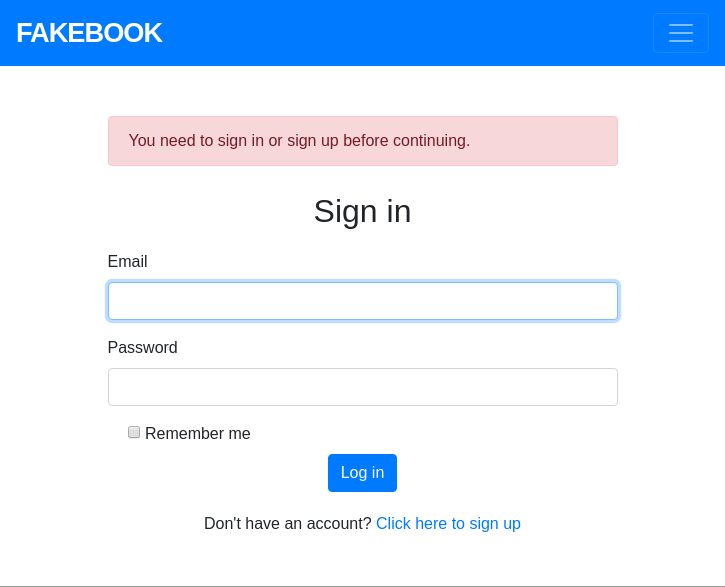
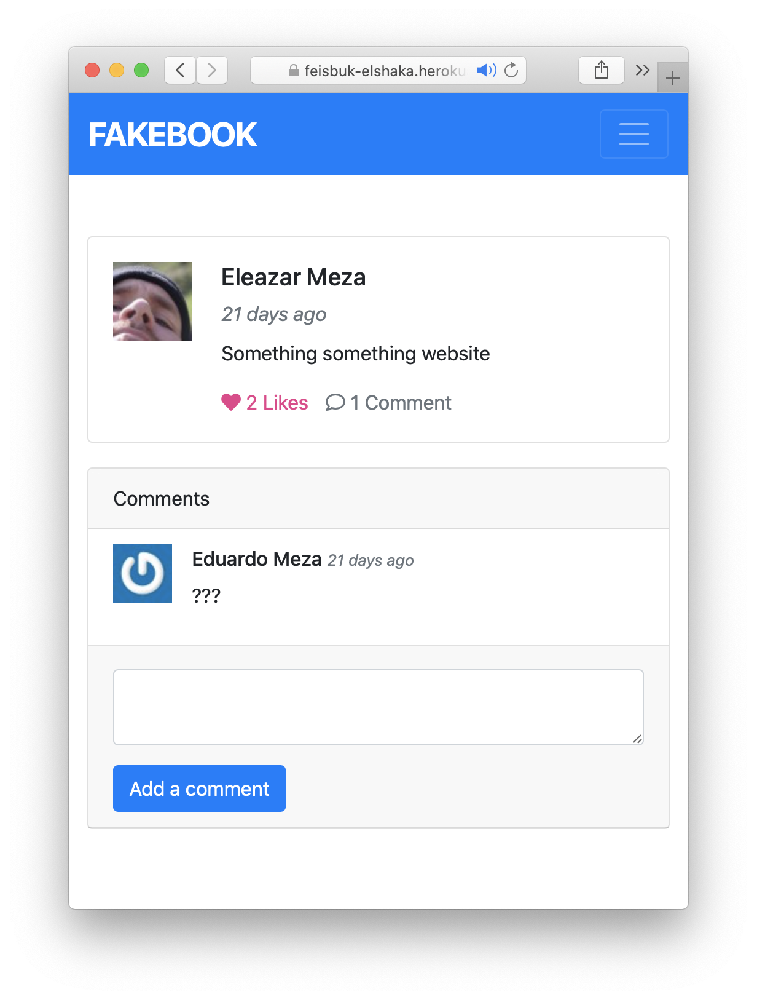
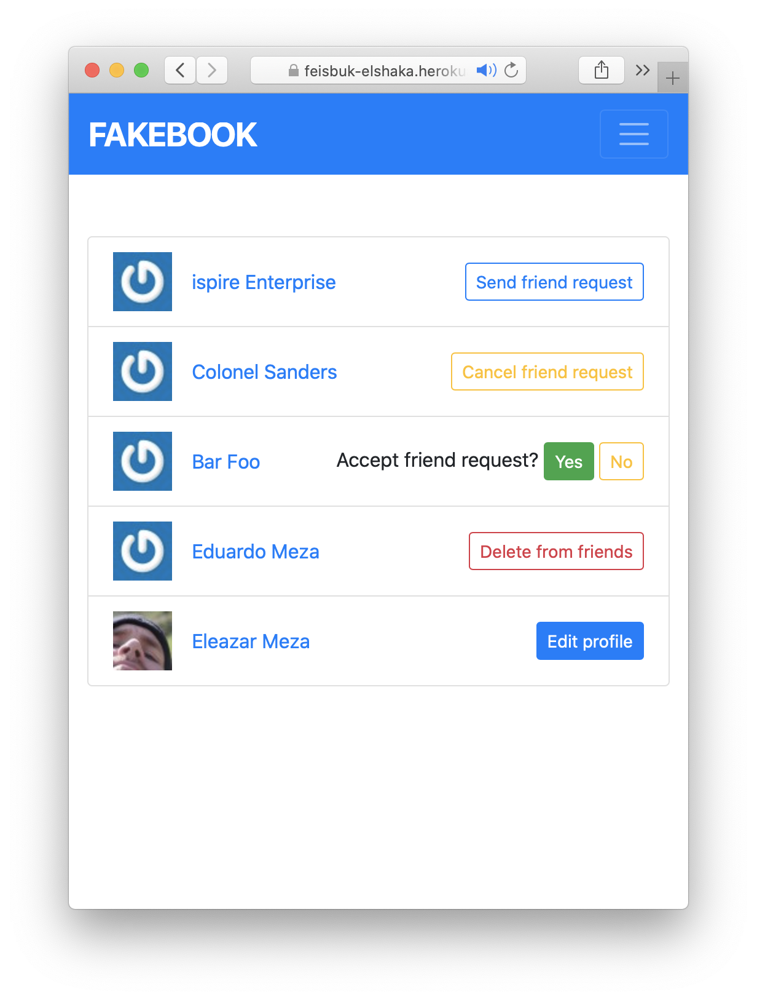
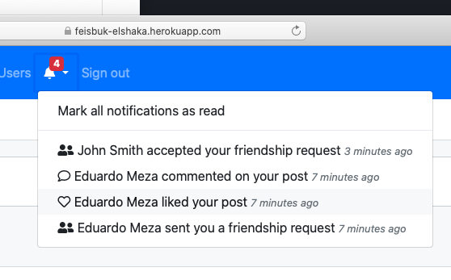
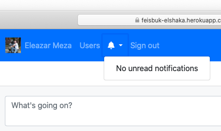

# Odin Facebook

|   | 
| ------------- | ------------- |
|   |   |
|   |   |

## About this repository

This repository stores a Ruby on Rails project which consists of creating a web service that mimics Facebook. The full description for this practice can be found at the following link: [The Odin Project - Ruby on Rails - Final Project](https://www.theodinproject.com/courses/ruby-on-rails/lessons/final-project).

## Built with

- Ruby on Rails
- jQuery
- PostgreSQL
- Bootstrap
- Devise
- [omniauth-facebook](https://github.com/simi/omniauth-facebook)

## Features

- User signup and signin.
- Signin with facebook support.
- Profile images retrieved from Gravatar.
- Posts, likes and comments.
- Friendship requests (create, cancel, accept, reject).
- Notifications for comments, likes and friendhips (retrieved asynchronously)

## Live version

[Odin Facebook @ Heroku](https://feisbuk-elshaka.herokuapp.com)

## Installation and getting started

To run this locally you'll need [PostgreSQL](https://www.postgresql.org/) and [Ruby](ruby-lang.org) on [Rails](rubyonrails.org) properly installed and set-up. If that's your case the following sequence of commands may help you install this project:

```
git clone https://github.com/frederico-miranda/odin-fakebook/
cd 'odin-fakebook'
bundle install
rails db:setup
```

In order for the facebook login integration to work, you'd need to setup the environment variables ADD_ID and APP_SECRET with the valid credentials of a facebook app (You can create one with a facebook developer account). You could then run the server like this:

```
APP_ID=<YOUR APP ID> APP_SECRET=<YOUR APP SECRET> rails s
```

## Authors

👤 **Eleazar Meza**

- Github: [@elshaka](https://github.com/elshaka)
- Twitter: [@elshaka](https://twitter.com/elshaka)
- Linkedin: [Eleazar Meza](https://www.linkedin.com/in/elshaka/)

👤 **Frederico Miranda**

- Github: [@frederico-miranda](https://github.com/frederico-miranda/)
